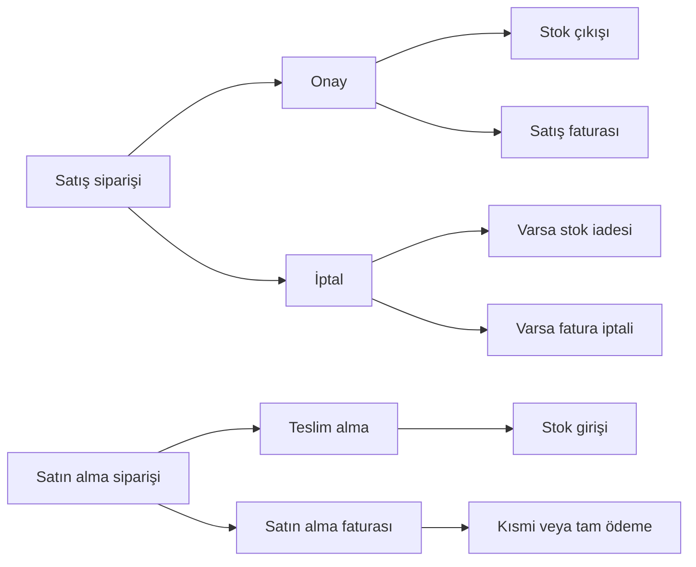

<div align="center">

# MiniERP

**Küçük ve orta ölçekli işletmeler için modern, rol tabanlı ERP uygulaması**

Satış · Satın alma · Stok · Fatura · Ödeme · Gider · Raporlama

</div>

---

## Proje hakkında

MiniERP; bir işletmenin ürün, stok, müşteri, tedarikçi ve finansal operasyonlarını tek panelden yönetmek için geliştirilmiş tam yığın bir web uygulamasıdır. Uygulama, Next.js App Router üzerinde sunucu tarafı yetkilendirme ve iş akışlarını; Prisma ile PostgreSQL üzerinde tutarlı veri işlemlerini bir araya getirir.

> [!IMPORTANT]
> Bu depo bir ERP temeli ve demo uygulamasıdır. Hiçbir yazılım mutlak güvenlik garantisi veremez. Canlı kullanımdan önce aşağıdaki **Güvenlik** ve **Üretime alma** bölümlerini uygulayın; ayrıca kendi tehdit modelinize uygun bağımsız güvenlik incelemesi yapın.

## Öne çıkan özellikler

| Alan | Yetenekler |
| --- | --- |
| Yönetim paneli | Aylık satış ve gider özeti, tahmini kâr, kritik stoklar ve grafikler |
| Ürün ve stok | Ürün/kategori yönetimi, minimum stok seviyesi ve stok hareketleri |
| Satış | Çok kalemli sipariş, KDV/iskonto hesabı, onay, iptal ve otomatik stok çıkışı |
| Satın alma | Tedarikçi siparişi, teslim alma, iptal ve otomatik stok girişi |
| Fatura ve ödeme | Satış/satın alma faturaları, kısmi ödeme durumu ve yazdırılabilir fatura görünümü |
| İş ortakları | Bireysel/kurumsal müşteriler ile tedarikçi kayıtları |
| Finans ve raporlar | Gider takibi, ödeme kayıtları, satış/stok/kârlılık raporları |
| Kullanıcı yönetimi | Beş rol, rol tabanlı menü ve sunucu tarafında erişim denetimi |
| Arayüz | Duyarlı tasarım, açık/koyu tema, bildirimler ve tekrar kullanılabilir bileşenler |

## Teknoloji yığını

| Katman | Teknoloji |
| --- | --- |
| Uygulama | Next.js 15, React 19, TypeScript |
| Arayüz | Tailwind CSS, Lucide React, Recharts, Sonner |
| Form ve doğrulama | React Hook Form, Zod |
| Kimlik doğrulama | NextAuth.js, Credentials Provider, JWT |
| Veri | PostgreSQL, Prisma ORM |
| Parola güvenliği | bcrypt |
| Test | Node.js test runner, tsx |

## Hızlı başlangıç

### Gereksinimler

- Node.js 20 veya üzeri
- npm
- Docker ve Docker Compose ya da erişilebilir bir PostgreSQL sunucusu

### 1. Bağımlılıkları yükleyin

```bash
npm ci
```

### 2. PostgreSQL'i başlatın

Depodaki Compose yapılandırması yalnızca yerel geliştirme içindir:

```bash
docker compose up -d postgres
```

Harici bir PostgreSQL kullanıyorsanız bu adımı atlayın ve `DATABASE_URL` değerini kendi bağlantınıza göre ayarlayın.

### 3. Ortam dosyasını oluşturun

macOS/Linux:

```bash
cp .env.example .env
```

PowerShell:

```powershell
Copy-Item .env.example .env
```

Ardından `.env` içindeki tüm yer tutucuları değiştirin. Güçlü bir `NEXTAUTH_SECRET` üretmek için Node.js kullanabilirsiniz:

```bash
node -e "console.log(require('crypto').randomBytes(32).toString('base64url'))"
```

| Değişken | Açıklama | Güvenlik notu |
| --- | --- | --- |
| `DATABASE_URL` | PostgreSQL bağlantı adresi | Üretimde ayrı ve en az yetkili veritabanı hesabı kullanın |
| `NEXTAUTH_URL` | Uygulamanın herkese açık ana adresi | Üretimde `https://` kullanın |
| `NEXTAUTH_SECRET` | Oturum belirteçlerini imzalar | En az 32 karakter, rastgele ve ortama özel olmalıdır |
| `SEED_ADMIN_EMAIL` | Demo seed işleminin oluşturacağı yönetici | Gerçek bir parola veya e-posta değerini depoya eklemeyin |
| `SEED_ADMIN_PASSWORD` | Demo yöneticisinin parolası | En az 12 karakter, benzersiz ve güçlü olmalıdır |

> [!CAUTION]
> `.env.example` içindeki veritabanı bilgileri ve `docker-compose.yml` içindeki `postgres/postgres` hesabı yalnızca yerel geliştirme kolaylığı içindir. Bu değerleri üretimde kullanmayın; `.env` dosyasını sürüm kontrolüne eklemeyin.

### 4. Veritabanını hazırlayın

```bash
npm run prisma:generate
npm run prisma:migrate
```

İsteğe bağlı demo verilerini yüklemek için:

```bash
npm run prisma:seed
```

> [!WARNING]
> `npm run prisma:seed` mevcut kullanıcılar dâhil uygulama tablolarındaki verileri siler ve demo verileriyle yeniden oluşturur. Komutu yalnızca boş veya gözden çıkarılabilir bir geliştirme veritabanında çalıştırın. Üretimde çalıştırmayın.

Seed tamamlandıktan sonra `.env` dosyasında belirlediğiniz `SEED_ADMIN_EMAIL` ve `SEED_ADMIN_PASSWORD` ile giriş yapabilirsiniz. Depoda hazır bir yönetici parolası bulunmaz.

### 5. Uygulamayı çalıştırın

```bash
npm run dev
```

Tarayıcıdan `http://localhost:3000` adresini açın.

## Rol ve erişim modeli

Yetkilendirme yalnızca menüyü gizlemekle sınırlı değildir. Middleware, sayfa kabuğu ve mutasyon yapan server action'lar erişimi sunucu tarafında tekrar denetler.

| Modül | Admin | Yönetici | Satış | Depo | Muhasebe |
| --- | :---: | :---: | :---: | :---: | :---: |
| Dashboard | ✓ | ✓ | ✓ | ✓ | ✓ |
| Ürünler | ✓ | ✓ | ✓ | ✓ | — |
| Kategoriler | ✓ | ✓ | — | ✓ | — |
| Stok | ✓ | ✓ | — | ✓ | ✓ |
| Müşteriler | ✓ | ✓ | ✓ | — | ✓ |
| Tedarikçiler | ✓ | ✓ | — | ✓ | ✓ |
| Satış | ✓ | ✓ | ✓ | — | — |
| Satın alma | ✓ | ✓ | — | ✓ | — |
| Faturalar | ✓ | ✓ | ✓ | — | ✓ |
| Ödemeler, giderler ve raporlar | ✓ | ✓ | — | — | ✓ |
| Ayarlar | ✓ | ✓ | — | — | — |
| Kullanıcılar | ✓ | — | — | — | — |

## Temel iş akışları



Sipariş toplamları saf domain fonksiyonlarıyla hesaplanır. Stok, sipariş ve fatura değişiklikleri ilgili servislerde Prisma transaction'ları içinde yürütülerek yarım kalan güncellemelerin önüne geçilir.

## Mimari

```text
src/
├── app/                 # App Router sayfaları ve ince server action katmanı
├── components/          # UI, form, tablo, grafik ve yerleşim bileşenleri
├── constants/           # Navigasyon ve sabit tanımlar
├── domain/              # Framework/veritabanından bağımsız saf iş kuralları
├── lib/                 # Auth, yetki, Prisma, doğrulama ve yardımcılar
├── services/            # Use-case orkestrasyonu ve transaction sınırları
└── types/               # TypeScript tür genişletmeleri
prisma/
├── migrations/          # Sürümlenmiş veritabanı değişiklikleri
├── schema.prisma        # Veri modeli
└── seed.ts              # Yıkıcı demo veri kurulumu
```

Bağımlılık yönü `app → services → domain/lib` şeklindedir. Client bileşenleri mutasyonları ilgili server action üzerinden çağırır; domain katmanı üst katmanlara bağımlı değildir.

## Güvenlik

Kod tabanında bulunan başlıca kontroller:

- Parolalar düz metin olarak saklanmaz; bcrypt ile hash'lenir.
- Oturumlar sekiz saatlik JWT stratejisi kullanır; pasifleştirilen kullanıcı sunucu tarafında yeniden doğrulanır.
- Rol tabanlı erişim middleware, sunucu bileşeni ve server action seviyelerinde uygulanır.
- Kullanıcı girdileri işleme alınmadan önce Zod şemalarıyla doğrulanır.
- Kimlik tespitine dayalı zamanlama farkını azaltmak için bulunamayan kullanıcılarda sabit bir parola hash'i karşılaştırılır.
- Başarısız girişler hesap ve IP bazında uygulama belleğinde sınırlandırılır.
- `.env` ve yerel ortam dosyaları `.gitignore` ile sürüm kontrolü dışında tutulur.

Canlı ortam kontrol listesi:

- [ ] Geliştirme sırlarını, demo hesaplarını ve varsayılan PostgreSQL parolasını tamamen değiştirin.
- [ ] Uygulamayı yalnızca HTTPS üzerinden, güvenilir bir ters proxy arkasında yayınlayın.
- [ ] PostgreSQL portunu internete açmayın; ağ ve güvenlik duvarı erişimini sınırlandırın.
- [ ] Uygulama veritabanı kullanıcısına yalnızca gereken izinleri verin.
- [ ] Sırları kaynak kod yerine bir secret manager veya platform secret alanında saklayın.
- [ ] Gizli değerleri hiçbir zaman `NEXT_PUBLIC_` önekiyle tanımlamayın; bu önek istemci paketine açılan değişkenler içindir.
- [ ] Dağıtık/çok instance'lı kurulumda bellek içi giriş sınırlandırmasını Redis benzeri ortak bir depoyla değiştirin ve proxy IP başlıklarını güvenilir kaynaklarla sınırlayın.
- [ ] Güvenlik başlıklarını (`Content-Security-Policy`, HSTS ve ilgili başlıklar) dağıtım katmanında tanımlayıp doğrulayın.
- [ ] Bağımlılık ve imaj taramalarını CI içinde düzenli çalıştırın; güvenlik güncellemelerini geciktirmeyin.
- [ ] Şifreli, erişimi kısıtlı ve geri yüklemesi test edilmiş veritabanı yedekleri oluşturun.
- [ ] Loglarda parola, oturum belirteci, bağlantı adresi ve kişisel veri bulunmadığını denetleyin.
- [ ] Üretim öncesi yetki matrisi, iş kuralları ve OWASP odaklı güvenlik testleri uygulayın.

Güvenlik açığı fark ederseniz hassas ayrıntıları herkese açık issue içinde paylaşmayın. Depo sahibiyle özel bir kanal üzerinden iletişim kurun ve yeniden üretim adımlarını yalnızca yetkili kişilerle paylaşın.

## Üretime alma

Üretim ortamında geliştirme migrasyonu veya demo seed kullanmayın. Migrasyonları tercihen CI/CD içinde ve kontrollü bir dağıtım adımı olarak çalıştırın. Tipik sıra:

```bash
npm ci
npm run prisma:generate
npx prisma migrate deploy
npm run build
npm start
```

> [!NOTE]
> Mevcut seed dosyası güvenli bir üretim yöneticisi oluşturma akışı değildir. İlk üretim yöneticisi için demo verilerini silmeyen, tek kullanımlık ve denetlenebilir bir bootstrap/provisioning süreci hazırlamadan uygulamayı canlıya almayın.

Resmî başvuru kaynakları:

- [Next.js üretim kontrol listesi](https://nextjs.org/docs/app/guides/production-checklist)
- [Next.js Content Security Policy rehberi](https://nextjs.org/docs/app/guides/content-security-policy)
- [Prisma üretim migrasyonları](https://docs.prisma.io/docs/cli/migrate/deploy)
- [OWASP parola saklama rehberi](https://cheatsheetseries.owasp.org/cheatsheets/Password_Storage_Cheat_Sheet.html)

## Komutlar

| Komut | Açıklama |
| --- | --- |
| `npm run dev` | Geliştirme sunucusunu başlatır |
| `npm run build` | Üretim derlemesi oluşturur |
| `npm start` | Derlenmiş uygulamayı başlatır |
| `npm run lint` | ESLint denetimini çalıştırır |
| `npm test` | Domain birim testlerini çalıştırır |
| `npm run prisma:generate` | Prisma Client üretir |
| `npm run prisma:migrate` | Geliştirme migrasyonlarını uygular |
| `npm run prisma:seed` | Veritabanını silip demo verileri yükler |

## Doğrulama

Değişiklik göndermeden önce en az şu kontrolleri çalıştırın:

```bash
npm run lint
npm test
npm run build
```

---

<div align="center">
  <sub>MiniERP · Next.js, TypeScript, Prisma ve PostgreSQL ile geliştirildi.</sub>
</div>
